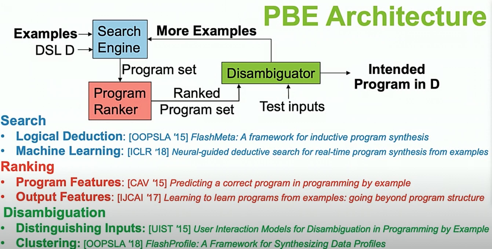

Research talks
=========================

<!-- <code>Google scholar is my facebook, these research talks are my popcorn TV series.
</code> -->

#### Inspiring research talks 

Hans Rosling: [The best stats you've ever seen](https://www.ted.com/talks/hans_rosling_the_best_stats_you_ve_ever_seen)

Jeff Heer: [A brief history of data visualization](https://www.youtube.com/watch?v=N00g9Q9stBo)
<pre> 
The visualization pipelines have been consistent behind many different techniques: (raw data -[data transformation]-> data tabels -[visual encodings]-> visual structures -[view transformations]-> views). 
</pre>

Aditya Nori: [Probabilistic Programming: Algorithms, Applications and Synthesis](https://www.youtube.com/watch?v=F4sFD9RyJrs)
<pre> Two challenges: (1) bringing data into programs (numerous new sources, conversion); (2) reasoning with data. 

Two benefits of probabilistic programming: (1) hides complexity of inference techniques; (2) requires much less expertise to write and experiment with ML models.
</pre>

Sumit Gulwani: [programming by examples: pl meets ml](https://youtu.be/-IjU2-Pi6gg?t=2480)

Amy Ko: [Big ideas behind the Whyline](https://www.youtube.com/watch?v=lx7g-T10WxQ)
<pre>
A nice summary of whyline: (1) Debugging is slow becuase developers iteratively test brittle hypotheses about what caused a failure by manually collecting runtime data. (2) Debugging would be faster if developers worked backwards from well-understood failure to cause, relying on dynamic dependencies precisely gathered by a tool. 
</pre>

Arvind Satyanayaran, [Declarative Interactive Design for Data Visualization](https://www.youtube.com/watch?v=bAnxCRHn2Rw)

<pre>
    (1) Declarative primitives for interaction. (2) the reactive nature of visualization architecture.
</pre>

Juho Kim: [Learnersourcing: Improving Learning with Collective Learner Activity](https://www.slideshare.net/mcpanic/20150730-thesisdefenseweb)

<pre>
    The last few slides on Learning @ Scale inspired me to get a Ph.D.. 
</pre>

#### Interesting research talks but not in my area. 

Aditya Vashistha: [Social Computing for Social Good in Low-Resource Environments](https://www.youtube.com/watch?v=BVF3tryFb2g)

Elena L. Glassman: [Clustering and Visualizing Solution Variation in Massive Programming Classes](https://www.youtube.com/watch?v=Pt-DMk1YRJ4)