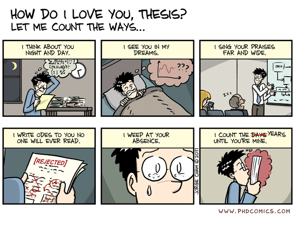

Thesis
=========================

<!-- <code>"No one reads a Ph.D. thesis. " 
"No. I did."
</code> -->

 
 

- [Type of phd thesis (from Allen Newell)](https://www.eecs.harvard.edu/htk/phdadvice/#3)
    - Opens up new area
    - Provides unifying framework
    - Resolves long-standing question
    - Thoroughly explores an area
    - Contradicts existing knowledge
    - Experimentally validates theory
    - Produces an ambitious system
    - Provides empirical data
    - Derives superior algorithms
    - Develops new methodology
    - Develops a new tool
    - Produces a negative result

- [What is your thesis?](http://web.cs.ucla.edu/~palsberg/shivers.html)

#### A collection of hci phd theses

Anind Dey: [Providing Architectural Support for Building Context-Aware Applications]((https://www.cc.gatech.edu/fce/ctk/pubs/dey-thesis.pdf).
Other docs: [proposal](https://pdfs.semanticscholar.org/50c3/a22313d0eb9398afd2730cc6b5f8c2aaa8ad.pdf); [research paper](ftp://ftp.cc.gatech.edu/pub/gvu/tr/1999/99-23.pdf); [notes](http://haojian.github.io/notes/notes-dey-thesis.pdf);
<pre>
By identifying, implementing and supporting the right abstractions and services for handling context, we can construct a framework that makes it easier to design, build and evolve context-aware applications.
</pre>

Jeff Heer: [Supporting Asynchronous Collaboration for Interactive Visualization](https://homes.cs.washington.edu/~jheer/files/jheer-thesis.pdf) 
<pre>This thesis focuses on the central problem of how to design visualization systems that support and catalyze social sensemaking by analysts and decision-makers collaborating asynchronously. </pre>

Michael Bernstein: [Crowd-Powered Systems](https://hci.stanford.edu/publications/2012/CrowdPoweredSystems/phd-thesis-msbernst.pdf)
<pre>
This thesis proposes that combining computing with the intelligence of crowds — large groups of people connecting and coordinating online — allows the creation of hybrid human-computer systems that overcome the limits of the user-system tradeoff.
</pre>

Bill Schilit: [A System Architecture for Context-Aware Mobile Computing](https://sites.google.com/site/schilit/schilit-thesis.pdf?attredirects=0)
<pre>This thesis contends that traditional software approaches are ill-suited for building mobile distributed computing software. System dynamics result in software that must be manually reconfigured when features change, and software that is constantly mis-tuned for the current computing environment. This thesis proposes an architecture for notifying applications of the changing computing environment that is simple, fault tolerant, efficient, scalable, and feasible to implement across a range of computing platforms.</pre>

Jason Hong: [An Architecture for Privacy-Sensitive Ubiquitous Computing](http://www.cs.cmu.edu/~jasonh/publications/jihdiss.pdf); [infrastructure, framework, library, toolkit](http://citeseerx.ist.psu.edu/viewdoc/download?doi=10.1.1.469.6574&rep=rep1&type=pdf), [Mobisys 04](https://dl.acm.org/doi/pdf/10.1145/990064.990087)
<pre>
It is difficult to create privacysensitive ubicomp applications for three reasons: (1) it is hard to analyze privacy needs; (2) it is hard to design effective user interfaces for privacy; (3) it is hard to implement privacy-sensitive systems.
</pre>

Scott Klemmer: [Tangible User Interface Input: Tools and Techniques](https://hci.stanford.edu/publications/2004/klemmer-dissertation/KlemmerDissertation.pdf) 
<pre>
Developing tangible interfaces is problematic because programmers are responsible for acquiring and abstracting physical input.  The Papier-Mâché toolkit introduces a novel software architecture that (1) lowers the threshold for developing applications by identifying high-level abstractions of input technologies; (2) supports switching input technologies with minimal code changes; (3) makes debugging easier through monitoring facilities that include Wizard of Oz control. 
</pre>

Sauvik Das: [Social Cybersecurity: Reshaping Security Through An Empirical Understanding of Human Social Behavior](http://reports-archive.adm.cs.cmu.edu/anon/hcii/CMU-HCII-17-100.pdf)
<pre>Social influences strongly affect cybersecurity behaviors, and it is possible to encourage better cybersecurity behaviors by designing security systems that are more social.
</pre>

Blase Ur: [Supporting Password-Security Decisions with Data](https://www.blaseur.com/phdthesis.pdf)
<pre>
The objective of this thesis is to demonstrate how integrating data-driven insights about how users create and how attackers guess passwords into a tool that presents real-time feedback can equip users to make better passwords.
</pre>

Polo Chau: [Data Mining Meets HCI: Making Sense of Large Graphs](https://poloclub.github.io/polochau/papers/polo-chau-thesis.pdf)
<pre>
We bridge Data Mining and Human-Computer Interaction (HCI) to synthesize new methods and systems that help people understand and interact with massive graphs with billions of nodes and edges, in three inter-related thrusts: (1) Attention Routing, (2) Mixed-Initiative Sense making, and (3) Scaling Up.
</pre>

Ian Li: [Personal Informatics and Context: Using Context to Reveal Factors that Affect Behavior](http://reports-archive.adm.cs.cmu.edu/anon/hcii/CMU-HCII-11-106.pdf)
<pre>
A tool that allows users to associate contextual information with behavioral information can better reveal factors within one's life that affect behavior, compared to existing systems that only show behavioral information.
</pre>

Arvind Satyanarayan: [The Reactive Vega Stack: Declarative Interaction Design for Data Visualization](https://arvindsatya.com/files/thesis-augmented.pdf)
<pre>
This thesis introduces the Reactive Vega stack: two new declarative languages for interactive visualization that decouple specification (the what) from execution (the how).
</pre>

#### No-HCI theses inspired me.

Roy Thomas Fielding: [Architectural Styles and the Design of Network-based Software Architectures](https://www.ics.uci.edu/~fielding/pubs/dissertation/top.htm)
<pre>
REST emphasizes scalability of component interactions, generality of interfaces, independent deployment of components, and intermediary components to reduce interaction latency, enforce security, and encapsulate legacy systems.
</pre>

Jean Yang: [Preventing Information Leaks with Policy-Agnostic Programming](http://www.cs.cmu.edu/~jyang2/papers/jeanyang_phd_thesis.pdf)

<!-- 11. Gierad Laput: http://www.gierad.com/thesis-draft.pdf
12. Chris Harrison: 
    1. 
13. Jon Froehlich: 
14. Bjorn Hartmann:  -->