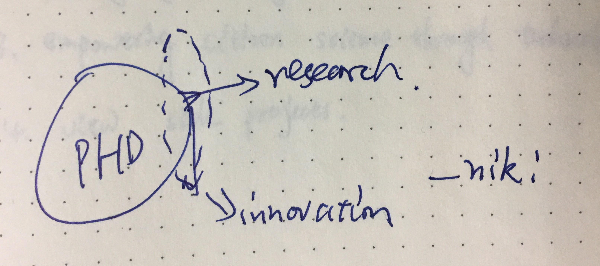

## Hoard these insightful diagrams.

----

July. 18, 2019

This was a 1TB hard drive in 1937.
It was the largest vertical letter file in the world. 4000 SqFt. with over 3000 drawers 10 feet long managed by 20 workers.
Access speed was ~3 minutes per KB.

June. 3, 2019

Apr. 23, 2018

Jan. 10, 2018

Dec. 31, 2018

Dec. 18, 2018

Knowledge, PhD, Research & Innovation - From Niki in the P&T class.

July. 17, 2018

The Discrimination Chain in Academia.

Sept. 22, 2017

My Ph.D. weekend life.

Sept. 21, 2017

Heilmeier Catechism.

Sept. 2, 2017:

Jason's favorite diagrams.

Aug. 16, 2017: 

Pasteur's Quadrant: Good science + good applications.

June. 15, 2017:

American time use survey.

